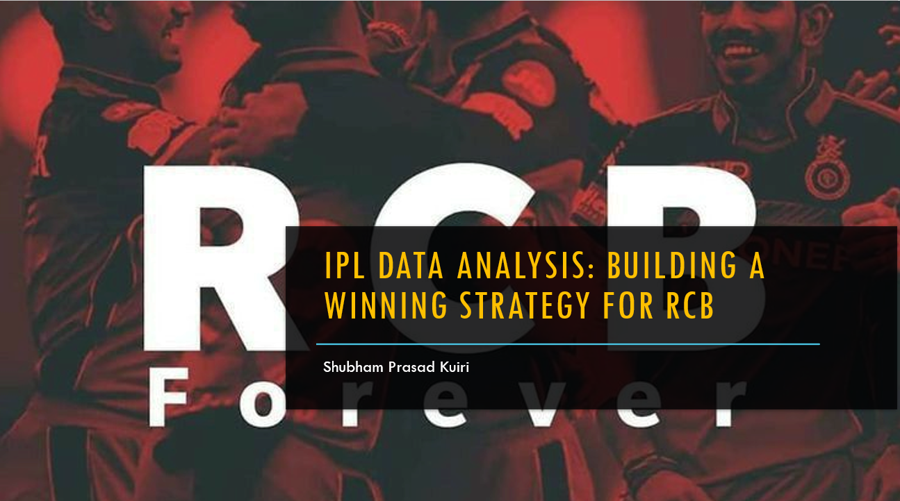

🏏 RCB IPL Performance Analysis
📖 Project Overview

This project is a data-driven analysis of Royal Challengers Bangalore’s (RCB) IPL performance using a structured relational database.

The goal was to investigate why RCB, despite having star players across seasons, has struggled to secure an IPL title — and to provide strategic, data-backed recommendations.

🎯 Objectives

Analyze season-wise team performance consistency

Evaluate toss decisions and venue impact

Measure player presence influence on win percentage

Assess squad balance between batting and bowling

Identify high-impact all-round contributors

🛠 Tech Stack

MySQL – Data extraction, joins, CTEs, aggregations, KPI computation

Excel – Data modeling, performance analysis, visualization

📊 Key Findings

Significant season-to-season volatility indicates lack of sustained momentum

Over-dependence on a few key players impacts overall stability

Bowling depth inconsistencies across multiple seasons

Multi-dimensional players contribute to stronger match control

💡 Strategic Recommendations

Focus on balanced squad construction instead of star-heavy lineups

Invest in adaptable bowlers and genuine all-rounders

Use historical performance metrics to guide auction strategy

🔎 Core Insight

Sustainable championships are built on structural balance and consistent collective performance — not isolated brilliance.

